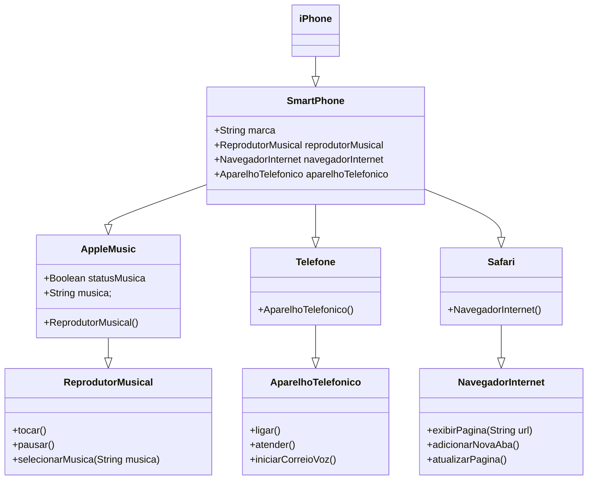

## Autores

- [Glayson Brenno Dumaresq dos Santos](https://github.com/brenno182021)

## POO - Desafio

### Modelagem e Diagramação de um Componente iPhone

### Funcionalidades

1. **Reprodutor Musical**
   - Métodos: `tocar()`, `pausar()`, `selecionarMusica(String musica)`
2. **Aparelho Telefônico**
   - Métodos: `ligar()`, `atender()`, `iniciarCorreioVoz()`
3. **Navegador na Internet**
   - Métodos: `exibirPagina(String url)`, `adicionarNovaAba()`, `atualizarPagina()`

### Diagram UML (Mermaid)

